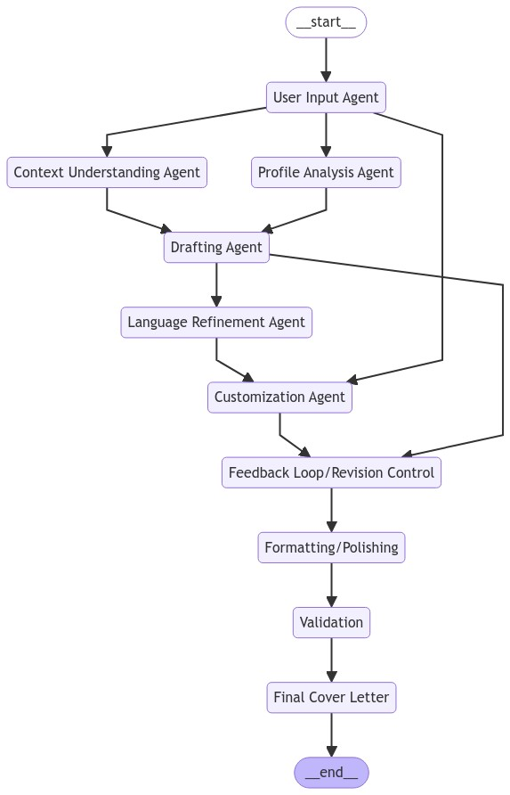

# Writer 

## Description

Simple Multi-agent llm to write several stuff like: 
- Cover letter 
- Scientific articles
- communication enhancement 
- ... 

## Write Cover letter 

## Installation

To install this project, follow these steps:

1. Clone the repository: `https://github.com/Ayman-Ameen/Writer.git`
2. Navigate to the project directory: `cd Writer`
3. Install ...

## Usage

TODO. 

## Contributing

Contributions are welcome! Please follow these guidelines:

1. Fork the repository
2. Create a new branch: `git checkout -b feature/your-feature`
3. Make your changes
4. Commit your changes: `git commit -m 'Add some feature'`
5. Push to the branch: `git push origin feature/your-feature`
6. Submit a pull request

## License
Later adding the License