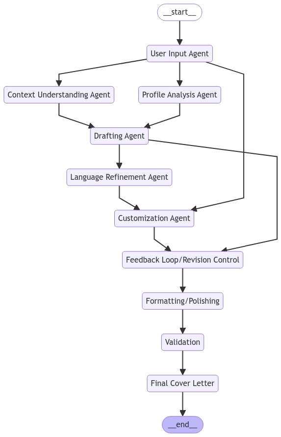

# Writer 

## Description

Simple Multi-agent llm to write several stuff like: 
- Cover letter 
- Scientific articles
- communication enhancement 
- ... 

## Write Cover letter 




## Installation

To install this project, follow these steps:

1. Clone the repository: 
```git clone https://github.com/Ayman-Ameen/Writer.git```
2. Navigate to the project directory:
    ```cd Writer```
3. Create a virtual environment: 
    ```conda create -n writer python=3.11```
4. Activate the virtual environment: 
    ```conda activate writer```
6. Install the package: 
    ```conda install pip```
7. Install the dependencies: 
    ```pip install -r requirements.txt```


## Usage

TODO. 

## Contributing

Contributions are welcome! Please follow these guidelines:

1. Fork the repository
2. Create a new branch: `git checkout -b feature/your-feature`
3. Make your changes
4. Commit your changes: `git commit -m 'Add some feature'`
5. Push to the branch: `git push origin feature/your-feature`
6. Submit a pull request

## License
The License will be added later. 
- The License can be changed without any prior notification. 